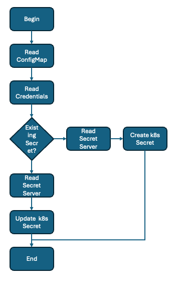
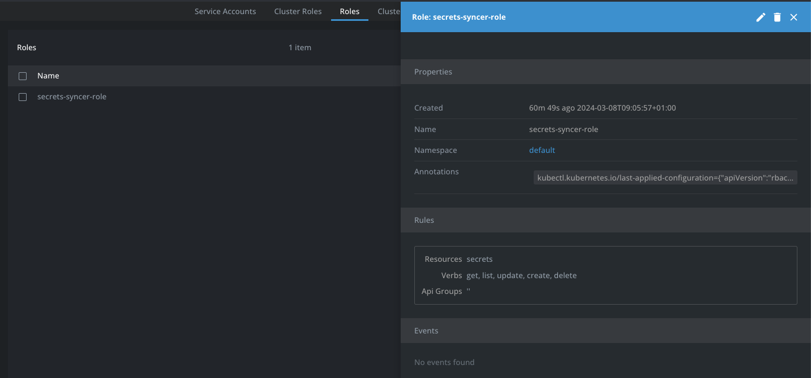
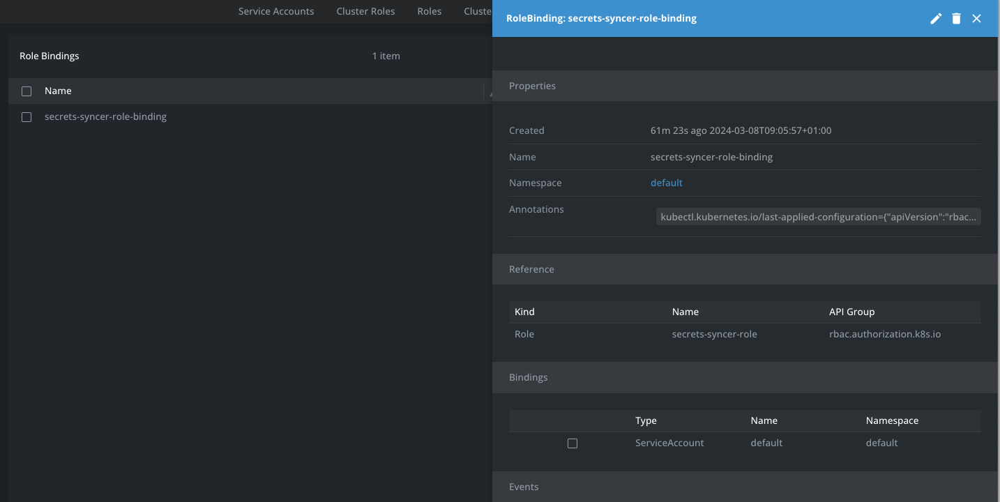
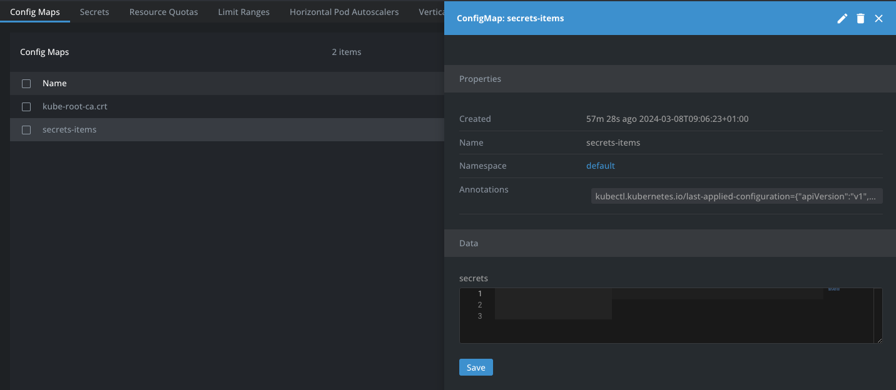
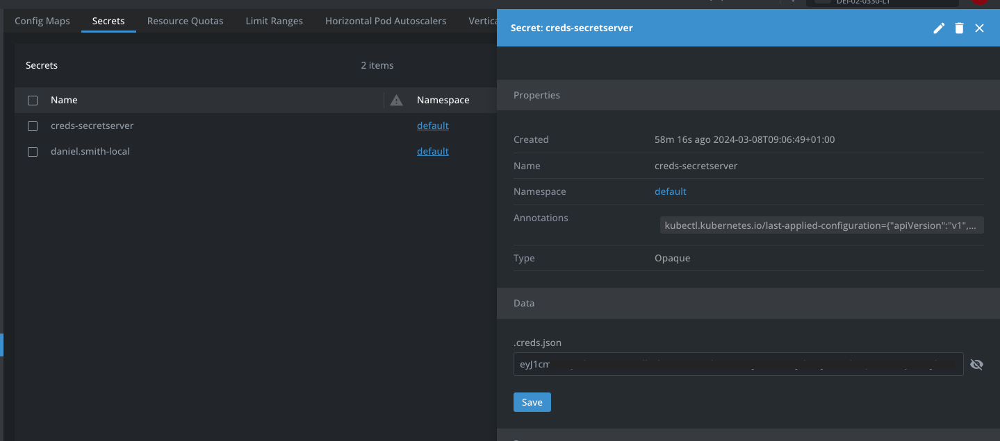
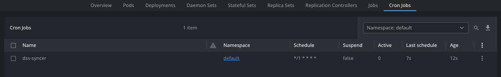

# Secrets Synchronizer from Secret Server to Kubernetes (prototype)

## Overview

This repo is created to make it possible to synchronize secrets from Delinea Secret Server to Kubernetes secrets. The below flow shows the working of the tool

The following YAML files are available, all will be deployed in the default Namespace.

1. **RBAC-creation.yaml** to allow the ServiceAccount to access secrets and manipulate them in the Namespace
2. **CM_secrets.yaml** holds the secrets that need to be synchronised to Kubernetes from Secret Server in clear text
3. **Secret_Server_secret.yaml** holds the information in a json file, base64 encrypted, for the connection to the Secret Server 
4. **cronjob.yaml** creates a cronjob, that will run every minute to sync the secrets mentioned in the configmap to Kubernetes secrets

## Initial setup

### Secret Server
Within Secret Server the following steps need to be configured. 

1. Create an API user that is an application account with a strong password
2. Provide **View** permissions to the Secrets in Secret Server that the API user must be able to access
3. Make sure **Webservices** are enabled so API calls can be made to Secret Server. More information can be found [here](https://docs.delinea.com/online-help/secret-server/webservices/enabling-webservices/index.htm)
4. For extra security, IP Restrictions can be setup for the created API user account, so it can only be accessed from a specific IP Address, or IP Range. More information can be found [here](https://docs.delinea.com/online-help/secret-server/admin/encryption-and-security/restricting-ip-addresses/index.htm).

### Kubernetes installation

This section describes the steps that need to be run before the syncer can work as a cronjob in Kubernetes

#### Files manipulation BEFORE deployment

For the syncer to work, make the nessecary changes to the two following yaml files:

1. **CM_secrets.yaml**: In the secrets field, mention the secrets that need to be synchronized. Make sure to keep the format as shown. Otherwise the deployment in Kubernetes will throw an error

    **DANGER** Kubernetes does not allow secrets to have a domain or machinename in the name of the secret. When this tool is used, make sure the ConfigMap for the secrets that need to be synchronzied, does ONLY contain the username. The underlaying Python script will use THAT name to find the secret and synchronize the information into Kubernetes.

2. **Secret_Server_secret.yaml**: This yaml file holds the secret information for the connection to the Secret Server in json format and is the coded as base64.

    **Example to create a base64 of the json information:** 
        
    *For Linux and Mac:*
    echo '{"url":"https://secretserver.delinealabs.local/secretserver","username":"API-user","passwd":"Delinea/4u"}' | base64

    *For Windows (PowerShell)*
    [convert]::ToBase64String([System.Text.Encoding]::Unicode.GetBytes('{"url":"https://secretserver.delinealabs.local/secretserver","username":"API-user","passwd":"Delinea/4u"}'))

#### Deployment
Deploy the following yaml files in the below order (used namespace is the default namespace):

1. **RBAC-creation.yaml**
2. **CM_secrets.yaml**
3. **Secret_Server_secret.yaml**
4. **cronjob.yaml**

## End effect

Within the Kubernetes environment the following should have been created (screenshots created from within [Lens](https://k8slens.dev):

1. A new Role, named secrets-syncer-role

    

2. A new Role Binding, named secrets-syncer-role-binding

    

1. A new ConfigMap, named **Secret-items**

    

2. A new Secret, named creds-secretserver with the base64 encoded json file

    

3. A new cronjob, named dss-syncer that will run every minute

    

## Extra files in the repo

The source code of the script, can be found as secrets_sync.py. Changes are yours to make to build a better script towards your environment. As Kubernetes is using containers, the dockerfile is also available to create your own containers.